# JAVA
JAVA 설치(홈페이지) - JDK21
---
### 1. [Oracle](https://www.oracle.com/kr/java/technologies/downloads/#jdk21-mac) 접속하여 파일 다운로드 및 설치

|설치과정|
|-|
||
||
||
||
||
||

<br>

### 2. 설치 및 버전 확인
- Spotlight 검색(command + space)에서 터미널 오픈 후 명령어 입력

> 명령어
```
java --version
```

|버전 확인|
|-|
||
||

<Br>

### 3. 설치 경로 확인
- Spotlight 검색(command + space)에서 터미널 오픈 후 명령어 입력

> 명령어
```
which java
```

|경로 확인|
|-|
||

<br>

### 4. 환경변수 설정

|환경변수|
|-|
||
||
||
||
||

<br>

> 1. Java 기본 설치 경로 이동
```
cd /Library/Java/JavaVirtualMachines
```
- 'ls' 명령어를 통해 설치한 JDK 파일 있는지 확인


<br>

> 2. 설치된 JDK 확인 후 홈 이동
```
cd 확인한 JDK 폴더명/Contents/Home
```

<br>


> 3. 환경변수로 설정할 JDK 경로 복사
```
pwd
```

<br>

> 4. 복사한 경로를 .bash_profile 에 붙여넣어 JAVA 경로 설정
```
vi ~/.bash_profile
```
- vi 편집기는 처음 실행시 읽기 모드
  
  - i를 눌러 insert 모드로 변환 후 입력

<br>

> 5. 환경변수 설정
```
export JAVA_HOME=/Library/Java/JavaVirtualMachines/jdk-21.jdk/Contents/Home
PATH=&{PATH}:&JAVA_HOME/bin
export JAVA_HOME
export PATH
```
- Esc 키를 눌러 vi 편집기를 insert 모드에서 다시 읽기 모드로 변경
  
  - 읽기 모드에서 shift + ; 눌러 나가기 모드로 전환
    
    - Wq! 입력 후 enter (저장 후 나가기)

<br>

> 6. vi편집기로 입력한 환경변수 값 적용
```
source .bash_profile
```
- vi편집기로 환경변수 값을 저장한 후 source 명령어를 이용해 적용

  - macOS 버전 10.15 인 ‘카탈리나’ 부터 기본 쉘 (Shell) 이 bash 에서 zsh (Z shell) 로 변경
  
  - 맥 터미널에서 zsh쉘을 디폴트로 사용하므로 bash_profile에 있는 환경변수들을 불러오지 못하는 문제 발생
 
    - `source: no such file or directory: .bash_profile`

<br>

#### 💡 [해결] .zshrc 파일을 vim로 들어가 아래 코드 작성
```
vim ~/.zshrc
```
```
if [ -f ~/.bash_profile ]; then
        . ~/.bash_profile
fi
```
- 터미널 종료 후 다시 실행

<br>

> 7. 설정된 환경변수 확인
```
echo $JAVA_HOME 
```
- JAVA_HOME 으로 입력한 값이 설정되었는지 확인

<br>

---

<br>

JAVA 설치(HOME BREW) - JDK1.8
---
### 1. [홈브류 홈페이지](https://brew.sh) 접속 후 Install Homebrew 명령어 복사

|brew|
|-|
||

<br>

### 2. 터미널에서 실행 후 맥북 비밀번호 입력 후 엔터
> 명령어
```
/bin/bash -c "$(curl -fsSL https://raw.githubusercontent.com/Homebrew/install/HEAD/install.sh)"
```

|brew|
|-|
||
||

<br>

### 3. 경로 설정

|brew|
|-|
||

> Next steps 의 명령어 추가 실행
```
echo >> /Users/사용자명/.zprofile
echo 'eval "$(/opt/homebrew/bin/brew shellenv)"' >> /Users/사용자명/.zprofile
eval "$(/opt/homebrew/bin/brew shellenv)"
```

<br>

### 4. 설치 확인

|brew|
|-|
||

> 명령어
```
brew --version
```

<br>

### 5. JAVA8 설치를 위한 명령어 입력
> Apple Silicon 인지 Intel인지 확인
```
arch
```
- arm64면 Apple Silicon, i386이면 Intel

<br>

> Rosetta 2 설치 (Apple Silicon Mac의 경우)
```
softwareupdate --install-rosetta --agree-to-license
```

<br>

> temurin@8 설치
```
brew install --cask temurin@8
```

<br>

> 설치 확인
```
/usr/libexec/java_home -V
```

|brew|
|-|
||

<br>

> JAVA_HOME 환경 변수 설정
```
export JAVA_HOME=$(/usr/libexec/java_home -v 1.8)
```

<br>

#### 💡 홈브류 기본 명령어
> 홈브류
```
brew update - brew 업데이트
brew search <패키지 이름> - 해당 패키지 검색
brew install <패키지 이름> - 해당 패키지 설치
```

<br>

> 확인
```
brew list - 설치 된 패키지 리스트 확인
brew info <패키지 이름> - 해당 패키지 상세 정보 확인
```

<br>
 
> 업그레이드 (업데이트)
```
brew outdated - 업데이트가 필요한 패키지 찾아보기
brew upgrade - 패키지 전체 업데이트
brew upgrade <패키지 이름> - 해당 패키지 업데이트
```

<br>

> 삭제
```
brew cleanup <패키지 이름> - 여러 개의 버전이 있을 때, 가장 최신 버전만 살리고 나머지는 삭제
brew uninstall <패키지 이름> - 해당 패키지 삭제
```

>> 홈브류 완전 삭제
```
/bin/bash -c "$(curl -fsSL https://raw.githubusercontent.com/Homebrew/install/master/uninstall.sh"
```

<br>

JAVA 설치(jenv) - JDK17
---
### 1. jenv 설치 
- 여러 자바 버전을 이용할 수 있는 Python 진영의 pyenv, Node 진영의 nvm 등과 유사한 툴

> homebrew 이용해 설치
```
$ brew install jenv
```

<br>

> PATH 설정
```
$ echo 'export PATH="$HOME/.jenv/bin:$PATH"' >> ~/.zshrc
$ echo 'eval "$(jenv init -)"' >> ~/.zshrc
```

<br>

> 변경사항 반영
```
$ source ~/.zshrc
```

<br>

> Export Plugin 설정
```
$ jenv enable-plugin export
```

<br>

> 설치 확인
```
$ jenv
```
- jenv를 입력했을 때 버전정보와 함께 명령어가 출력되면 정상적으로 설치된 것

<br>

### 2. Java 설치

> homebrew 저장소에서 설치가능한 JDK 검색
```
$ brew search jdk
>
openjdk           openjdk@11        openjdk@17       openjdk@8         jd                mdk               cdk
```

<br>

> 17 버전 선택해 설치
```
$ brew install openjdk@17
```

<br>

#### 💡 openjdk@8 설치 시 오류
```
openjdk@8: The x86_64 architecture is required for this software.
Error: openjdk@8: An unsatisfied requirement failed this build.
```
- openJDK 8 설치 시 Apple Silicon Chip에서는 오류 발생

  - azul 등 다른 JDK 이용해 설치

<br>

> Symbolic Link 작업
```
$ sudo ln -sfn /opt/homebrew/opt/openjdk@17/libexec/openjdk.jdk /Library/Java/JavaVirtualMachines/openjdk-17.jdk
```

<br>

> Symbolic Link 가 잘 연결됐는지 확인
```
$ ls /Library/Java/JavaVirtualMachines
>
openjdk-11.jdk     openjdk-17.jdk
```

<br>

> jenv에 설치한 JDK 등록
```
$ jenv add /Library/Java/JavaVirtualMachines/[JDK version name]/Contents/Home/
```
- JDK version name 부분에 해당하는 버전 기재 (ex. openjdk-17.jdk)

<br>

### 3. 사용 방법
> 설치된 Java 버전 확인
```
$ jenv versions
>
* system (set by /Users/geun/.jenv/version)
  11.0
  11.0.17
  17.0
  17.0.5
  openjdk64-11.0.17
  openjdk64-17.0.5
```

<br>

> 원하는 버전을 전역으로 사용
```
$ jenv global {JAVA_VERSION}
```
- {} 부분에 활성화할 Java 버전 입력

<br>

> 특정 위치에서만 사용하기
```
$ jenv local {JAVA_VERSION}
```
- {} 부분에 활성화할 Java 버전 입력

<Br>

JAVA 설치(apple) - JDK1.6
---
### 1. [애플](https://support.apple.com/ko-kr/106384)에서 OS X용 Java 이전 버전 다운로드

|-|
|-|
|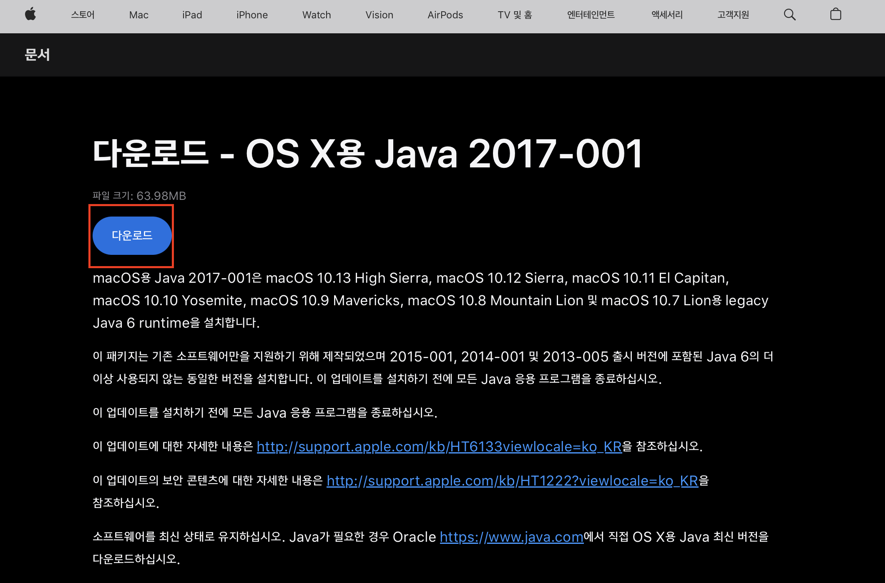|
|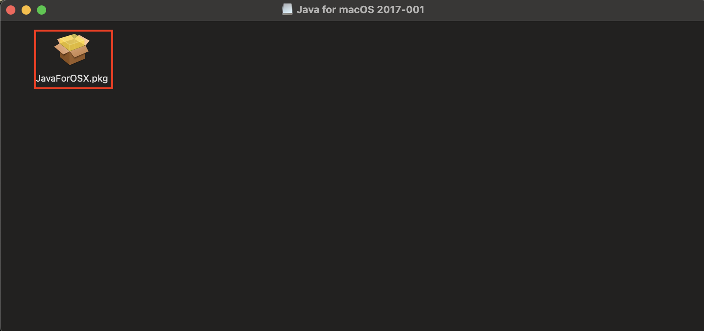|
|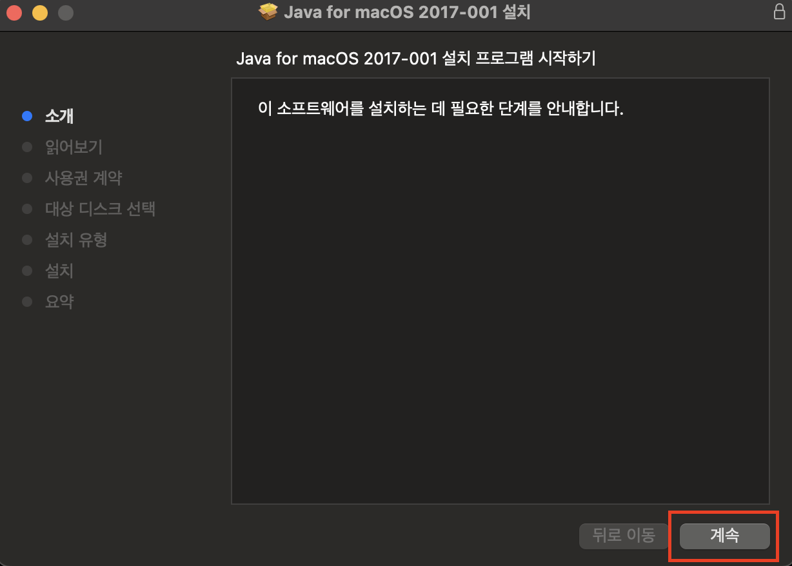|

<br>

---

<Br>

# Tomcat
톰캣 설치(homebrew) - 10.1
---
### 1. homebrew 업데이트 및 tomcat 찾기
> 홈브류 업데이트
```
brew update
```

<br>

> 톰캣 검색
```
brew search tomcat
```
- 초록 체크 표시가 있다면 이미 설치되어 있는 프로그램

<br>

|톰캣 검색 결과|
|-|
|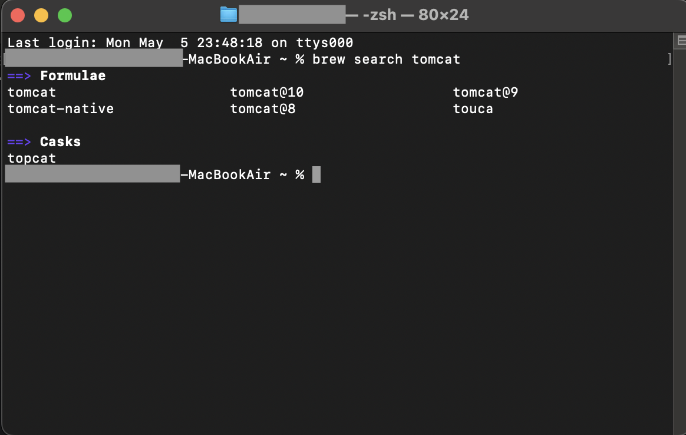|

<br>

### 2. tomcat 설치
> 설치
```
brew install tomcat@10
```
- 원하는 버전 선택하여 명령어 입력

- Summary 아래 주소는 설치경로로 앞으로 자주 쓸테니 메모해두기

<br>

|톰캣 설치 결과|
|-|
|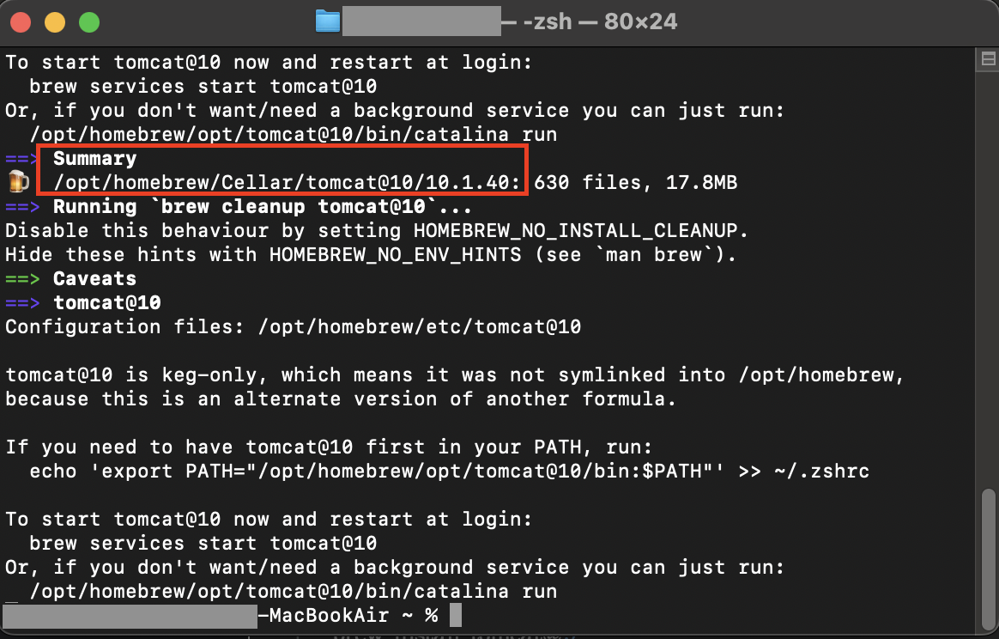|

<br>

### 3. 실행 및 종료
> 톰캣 설치 경로 내 bin 폴더로 이동
```
cd /opt/homebrew/Cellar/tomcat@10/10.1.40/bin
```

<br>

> catalina 실행
```
./catalina start
```
- 잘 안된다면 파일로 직접 들어가 경로 확인하고 폴더 내 catalina 파일 유무 확인

  - Finder 에서 command + shift + G(경로 입력 창) 열어서 경로 복붙

- 실행되었다면 `localhost:8080` 접속하여 톰캣페이지 확인

<br>

> catalina 종료
```
./catalina stop
```
- `localhost:8080` 접속시 로그인 창 or 연결할 수 없다고 뜨면 정상적으로 종료된 것

<Br>

|톰캣 실행 및 종료|
|-|
|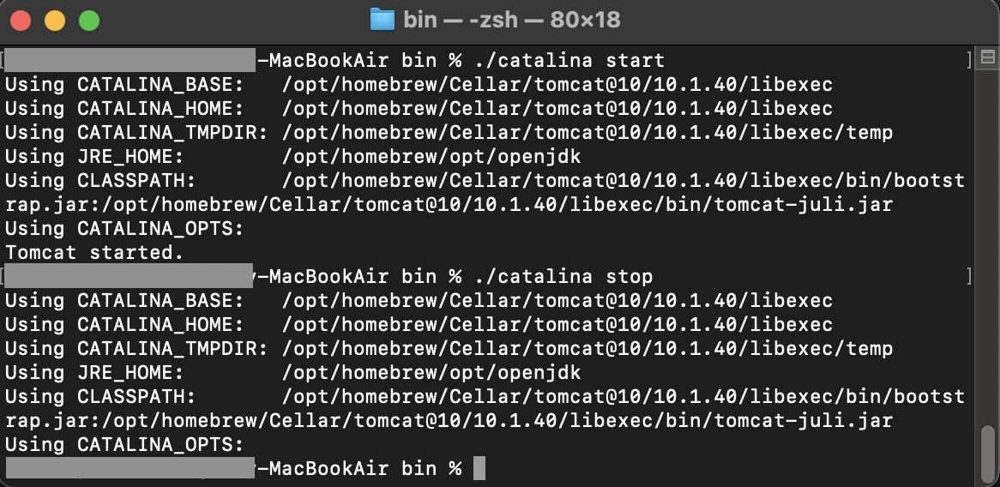|
|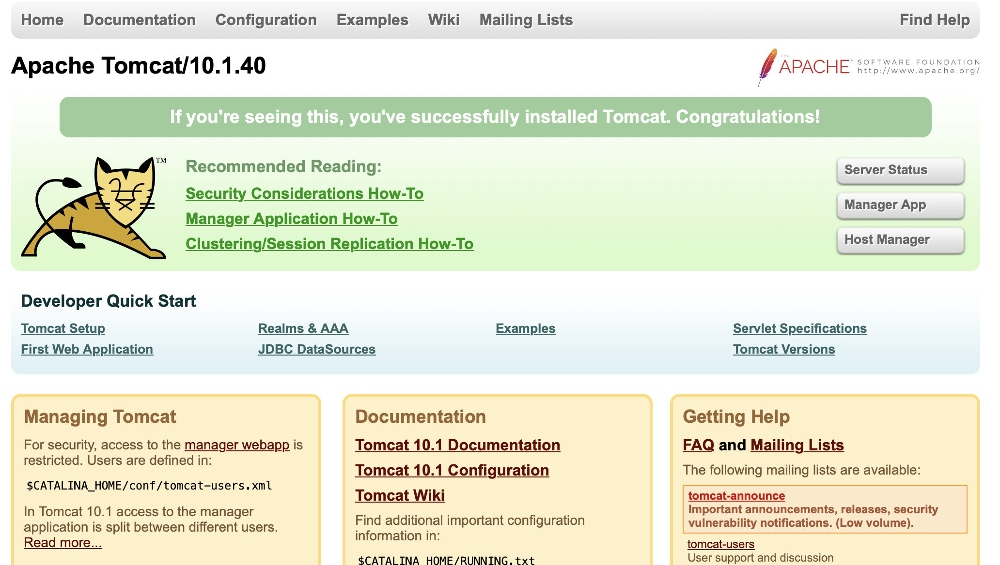|
|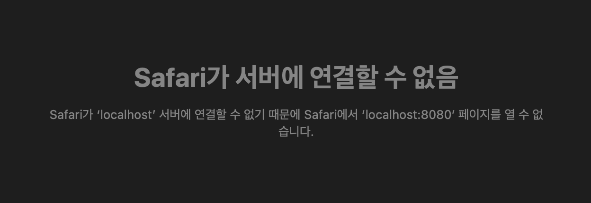|

<br>

---

<br>

# 이클립스
이클립스 설치 - 4.35
---
### 1. [이클립스](https://www.eclipse.org/downloads/packages/) 접속하여 파일 다운로드 및 설치
|Eclipse IDE for Enterprise Java and Web Developers|
|-|
||
||
||
||
||

<Br>

### 2. 바탕화면에 생긴 Eclipse 을 없애기
> 마우스우클릭 → 'Eclipse' 추출 클릭하여 추출

|Eclipse IDE for Enterprise Java and Web Developers|
|-|
||

<br>

---

<br>

# 전자정부프레임워크
전자정부프레임워크 - 4.3
---
### 1. [전자정부프레임워크 홈페이지](https://www.egovframe.go.kr/home/sub.do?menuNo=94) 접속 후 원하는 버전 다운로드

|eGov|
|-|
|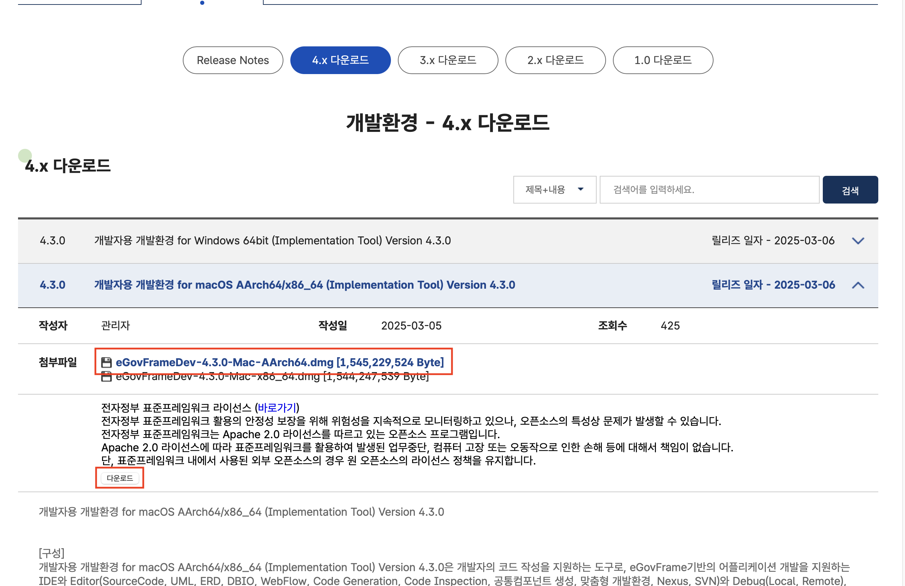|
|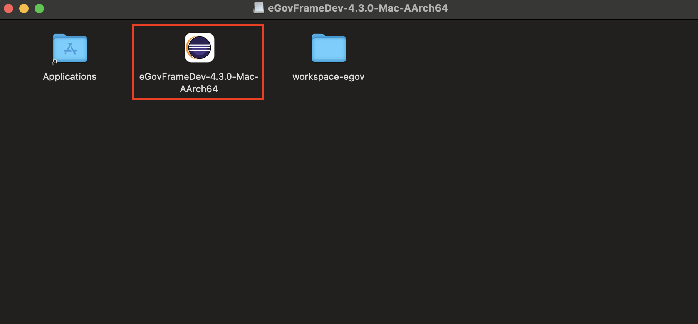|

<br>

### 2. 프로그램 설치
|eGov|
|-|
|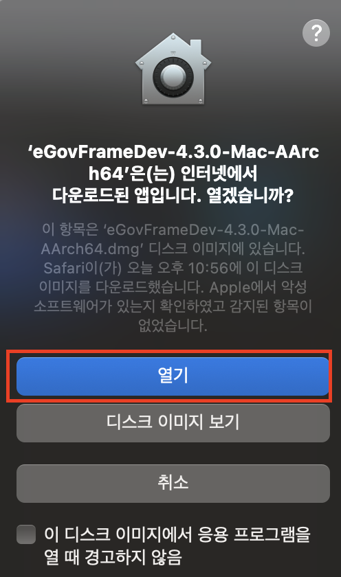|
|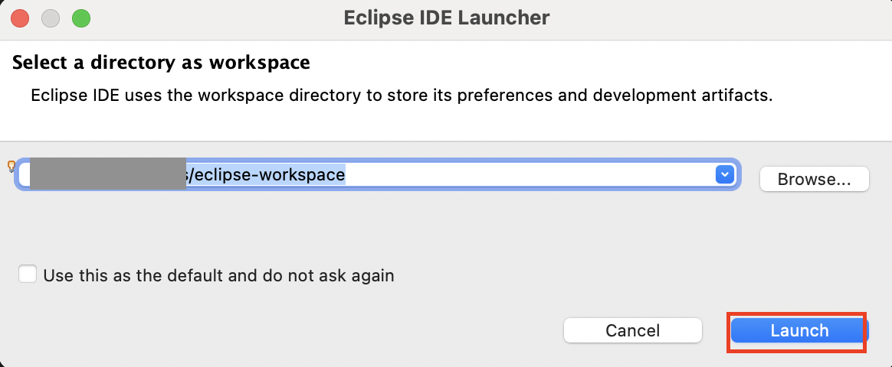|
|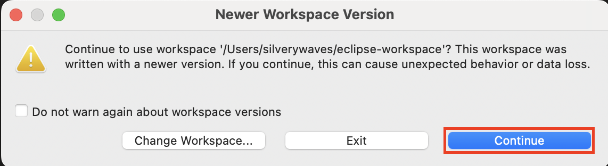|
|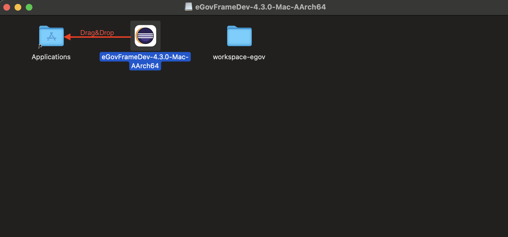|

<br>

### 3. 테스트 프로젝트 생성


<br>

---

<br>
