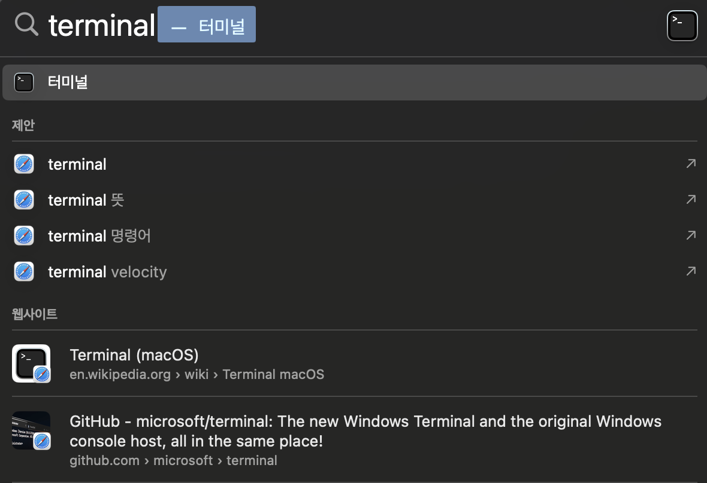
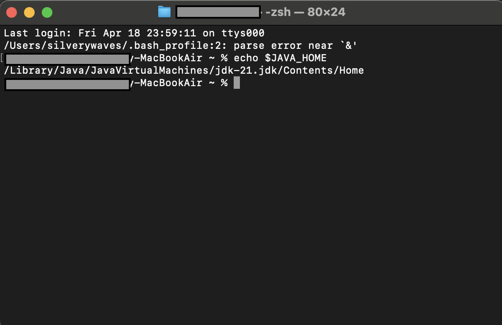

# IDE 설치 - ECLIPSE
JAVA 설치 - JDK21
---
### 1. [Oracle](https://www.oracle.com/kr/java/technologies/downloads/#jdk21-mac) 접속하여 파일 다운로드 및 설치

|설치과정|
|-|
||
||
||
||
||
||

<br>

### 2. 설치 및 버전 확인
- Spotlight 검색(command + space)에서 터미널 오픈 후 명령어 입력

> 명령어
```
java --version
```

|버전 확인|
|-|
||
||

<Br>

### 3. 설치 경로 확인
- Spotlight 검색(command + space)에서 터미널 오픈 후 명령어 입력

> 명령어
```
which java
```

|경로 확인|
|-|
||

<br>

### 4. 환경변수 설정

|환경변수|
|-|
||
||
||
||
||

<br>

> 1. Java 기본 설치 경로 이동
```
cd /Library/Java/JavaVirtualMachines
```
- 'ls' 명령어를 통해 설치한 JDK 파일 있는지 확인


<br>

> 2. 설치된 JDK 확인 후 홈 이동
```
cd 확인한 JDK 폴더명/Contents/Home
```

<br>


> 3. 환경변수로 설정할 JDK 경로 복사
```
pwd
```

<br>

> 4. 복사한 경로를 .bash_profile 에 붙여넣어 JAVA 경로 설정
```
vi ~/.bash_profile
```
- vi 편집기는 처음 실행시 읽기 모드
  
  - i를 눌러 insert 모드로 변환 후 입력

<br>

> 5. 환경변수 설정
```
export JAVA_HOME=/Library/Java/JavaVirtualMachines/jdk-21.jdk/Contents/Home
PATH=&{PATH}:&JAVA_HOME/bin
export JAVA_HOME
export PATH
```
- Esc 키를 눌러 vi 편집기를 insert 모드에서 다시 읽기 모드로 변경
  
  - 읽기 모드에서 shift + ; 눌러 나가기 모드로 전환
    
    - Wq! 입력 후 enter (저장 후 나가기)

<br>

> 6. vi편집기로 입력한 환경변수 값 적용
```
source .bash_profile
```
- vi편집기로 환경변수 값을 저장한 후 source 명령어를 이용해 적용

  - macOS 버전 10.15 인 ‘카탈리나’ 부터 기본 쉘 (Shell) 이 bash 에서 zsh (Z shell) 로 변경
  
  - 맥 터미널에서 zsh쉘을 디폴트로 사용하므로 bash_profile에 있는 환경변수들을 불러오지 못하는 문제 발생
 
    - `source: no such file or directory: .bash_profile`

<br>

#### 💡 [해결] .zshrc 파일을 vim로 들어가 아래 코드 작성
```
vim ~/.zshrc
```
```
if [ -f ~/.bash_profile ]; then
        . ~/.bash_profile
fi
```
- 터미널 종료 후 다시 실행

<br>

> 7. 설정된 환경변수 확인
```
echo $JAVA_HOME 
```
- JAVA_HOME 으로 입력한 값이 설정되었는지 확인

<br>


